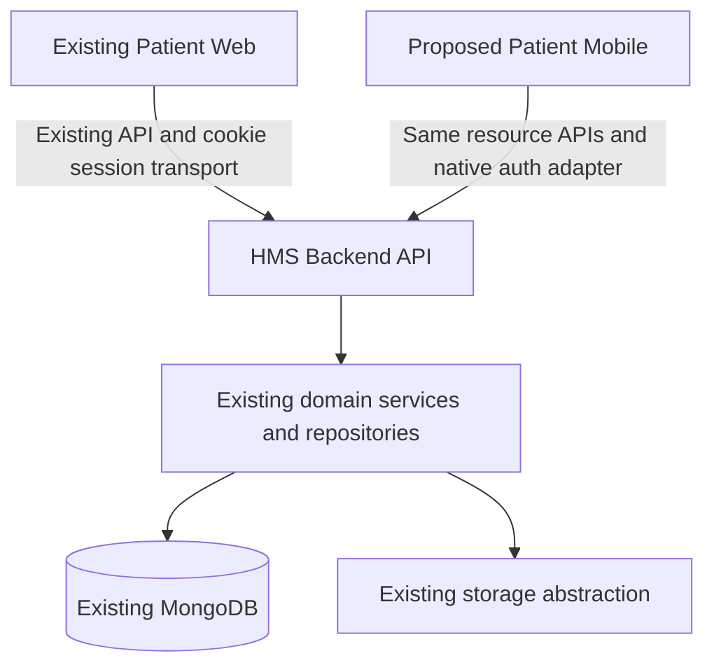

# E. Mobile Architecture — Proposed Decision

## E1. Technology

```text
Mobile:
React Native
Expo development builds
TypeScript
```

Status: DECISION REQUIRED. This extends the locked stack only for a future native client. It does not authorize switching the API/database or introducing another patient identity service. No packages were installed and no app project exists from this work.

The repository currently has React 19/TypeScript, TanStack Query, RHF and Zod in Patient Web. Reuse benefits are concrete: API field mappings, runtime schemas, query-key conventions, pure formatting/validation functions and existing backend rules. React component composition knowledge transfers. No automatic UI reuse percentage is claimed.

Cannot directly reuse DOM/CSS layouts, Phosphor CSS icon classes, browser history/window navigation, local/session storage globals, Blob/object-URL downloads, browser jsPDF save/print, React DOM portals, or Sonner's DOM implementation. Existing hooks with browser state need adapters/refactoring, not blind imports. Do not import Mongoose models or server secrets into a shared mobile package.

Native Android+iOS would create two client implementations with less TypeScript reuse. Flutter adds Dart and requires reauthoring the existing typed client conventions. Neither has a demonstrated project requirement that outweighs React Native/Expo's reuse at this stage. If an essential native SDK cannot run in the selected Expo development build, reassess that specific requirement before changing the recommendation.

Pin a mutually compatible Expo SDK, React Native, React, TypeScript and native module set when the project phase is approved. Do not carry web package versions into native without checking compatibility. Development builds contain this app's native modules; Expo Go is not acceptance evidence for native integrations. See [Expo development builds](https://docs.expo.dev/develop/development-builds/introduction/) and [build configuration](https://docs.expo.dev/build-reference/build-configuration/).

### Planned native dependencies, not installation instructions

| Capability | Candidate | Scope |
|---|---|---|
| Native app/dev client | Expo, React Native, expo-dev-client | MVP |
| Navigation | Expo Router using native navigation underneath; choose one navigation owner | MVP; final choice D01 |
| Secure credentials | expo-secure-store | MVP |
| Private files/picker/share | expo-file-system, expo-document-picker, expo-sharing | MVP |
| Connectivity | Native reachability adapter compatible with TanStack onlineManager | MVP; exact library approved with SDK |
| Forms/server state | Existing RHF/Zod/TanStack Query patterns with native components | MVP |
| PDF rendering/preview | Approved native viewer/platform preview; print/export module if needed | MVP documents/invoice export; SDK/license review |
| Notification handling | expo-notifications | Phase 2 only |
| Biometric unlock | expo-local-authentication/SecureStore support | Phase 2 only |
| Camera/image capture | Compatible Expo camera/image picker | Phase 2 only |
| App links | Native linking/navigation adapter + owned-domain association files | Phase 2 only |

Do not add these modules during Phase 0/1. No new general state framework, database, cache service or notification provider is required merely to define this architecture.

## E2. System boundary



Neither client accesses MongoDB or file storage directly. Patient Web and Mobile are sibling clients of the same backend. Native authentication adapts transport; clinical/billing/appointment state remains in existing domains.

## E3. Layers and responsibilities

```text
Screens
  -> Feature Hooks
     -> Domain Hooks (TanStack Query, as required by PROJECT_RULES)
        -> Domain Services
           -> API/Transport Layer
              -> HMS Backend
```

The requested simplified Screens -> Feature Hooks -> Domain Services -> API model is refined with the existing project Domain Hook convention; no new business-rule layer is introduced.

| Concern | Owner | Rules |
|---|---|---|
| Screens | Native UI/routing | Render states, collect input, invoke feature hook; no direct fetch/service calls |
| Cross-domain workflow | Feature hooks | Booking composes patient context, catalogue and appointment domain hooks; no duplicate server transitions |
| React Query | Domain hooks + app QueryClient boundary | Typed keys include account/patient/filter; enabled gating; targeted invalidation; queries retry safely, mutations do not blindly retry |
| Domain services | Typed client domain modules | Serialize inputs/validate responses through API adapter; no other domain's business rules |
| API client | Transport | Base URL, bearer header, JSON/errors, timeout/cancel, safe retry, single-flight refresh; never bearer query params |
| Auth lifecycle | Auth provider/feature + auth service | Session restore/logout/lock, user state; no auth inside individual screens |
| Tokens | Session manager | Access in memory; atomic secure refresh/session bundle; honor uncertain refresh policy |
| Secure storage | Platform adapter | Small secrets only; account/environment namespaces; delete on logout/reinstall marker mismatch |
| Zod | Domain contract schemas | Validate external response/link/form data, align server fields; not authorization |
| Navigation | One native navigator | Typed screen params, protected stacks, reset on account/patient changes |
| Files | File service + native adapter + domain hooks | Private picker/temp/preview/share; authenticated download; cleanup |
| Notifications | Notification domain + platform adapter | Phase 2 permission/registration/tap; server remains recipient authority |
| Deep links | Validating navigation adapter + feature resolver | Phase 2 allowlist; login -> context -> server target resolution; no arbitrary URL execution |
| Error handling | API error mapper + feature UI | Distinguish unauthorized, forbidden, validation, conflict, offline, unknown result and unavailable server |
| Logging | Redacted structured adapter | Follow Pino-only project rule where supported; no console/sensitive payload logging. Native logger compatibility must be approved before emitting device logs |

Proposed future structure (names only; not created):

```text
apps/patient-mobile/
  app/                 native routes/layouts; no business logic
  src/
    screens/
    features/          cross-domain feature hooks
    domains/           schemas, domain hooks and services
    auth/              lifecycle/session manager
    api/               transport and typed errors
    platform/          secure storage/files/connectivity/link adapters
    components/        native reusable UI
    config/            public environment/compatibility settings
    utils/             platform-neutral functions
```

The root workspace matches `apps/*`, but creating the directory is expressly deferred. No shared contract package exists today. Reuse/extract only platform-neutral contracts when authorized; a new `packages/*` workspace or root package change needs a separate scoped edit. Do not copy backend authorization or token-signing code into mobile for perceived reuse.

## E4. Proposed MVP navigation

Four tabs because proposed notifications are Phase 2. No Inbox tab until real patient inbox data exists. This structure is contingent on A's scope approval, not labelled “approved MVP.”

```text
Unauthenticated
  Phone entry -> Fixed-code entry -> Session restore/context
  Account/setup/support guidance for existing service eligibility errors

Home
  Selected patient banner
  Next appointment -> appointment detail
  Book appointment
  Recent records -> relevant complete history
  Billing shortcut

Appointments
  Upcoming / History
  Appointment detail
  OPD visit metadata detail (not consultation notes)
  Book: patient -> branch/department/doctor -> date/slot -> reason/confirm
  Reschedule: eligibility -> slot -> confirmation

Records
  Prescriptions -> prescription detail
  Laboratory -> verified result detail
  Imaging -> verified text report detail
  Documents -> metadata/preview -> explicit download/share
  Upload document (system picker)

Account
  Personal/guardian profile -> safe non-identity edit
  Existing family switcher
  Patient card
  Invoices -> detail/payments -> PDF/share
  Dental quotations -> read-only detail/options
  Security -> mobile sessions -> revoke / sign out all mobile devices
  Privacy / support / approved account-deletion entry
  Logout / account switch
```

Persistent selected-patient context applies to all clinical, appointment and billing screens. Security/session management is for the logged-in account, not the dependent. Profile without accessible patient renders an honest access/setup state. A revoked patient must not silently switch the pending action to another dependent.

Phase 2 route additions only if approved: Inbox, external links, new account/dependent onboarding, login-phone change, dental decision actions, biometrics, push settings, exports/cancellation. No UI placeholder suggests those actions work in MVP.

Use existing HMS identity/status/booking concepts with native lists, sheets and stacks. Provide loading, empty, permission-denied, expired session, validation, server error, stale/conflict, retry, upload progress and offline states. Touch target sizing, screen reader labels, dynamic text, focus/keyboard management, safe areas and explicit confirmation are native acceptance criteria. Critical status uses text plus color/icon. Do not port desktop tables/modals verbatim.

## E5. Security and lifecycle contract

| Situation | Required behavior |
|---|---|
| Access token | Memory only; no AsyncStorage, query-string URL, clipboard or analytics |
| Refresh credential | OS-backed SecureStore; token/session/account/environment bundle; backup exclusion; no full medical cache in SecureStore |
| Startup | Check installation marker, load secret bundle, restore according to C; no patient queries before authenticated state |
| Logout | Attempt server revoke, always clear access/secure bundle/query cache/patient selection/temp files; reset protected navigation |
| Offline logout | Local clear; no promise server immediately knows; no retained credential for automatic restore |
| Session expiry/revocation | Stop protected calls, clear secrets/data, login state; distinguish from transient network failure |
| App background/foreground | Hide sensitive task-switcher snapshot where supported; on resume reconcile session/grants and stale queries before displaying new data |
| Account switch | Full account cache/file/navigation reset and new login; never share query keys or pending mutation between accounts |
| Multiple devices/device loss | C's session list and revoke; device/installation ID is not proof; no local deletion substitutes for server revoke |
| Biometric unlock | Not implemented in MVP; future local credential gate with fallback, no backend bypass |
| Screenshots | Propose task-switcher privacy cover; owner decides Android secure-window restriction for clinical screens. Do not promise universal screenshot prevention on iOS or block explicit share without a product decision |
| Local files | App-private staging, cleanup, no public gallery by default; explicit exported copies cannot be recalled |
| Offline records | Memory-only current-session data with stale indication if retained; no persisted clinical store/offline mutation queue in MVP |
| Notifications/links | Deferred; future payload is untrusted until server resolves current recipient/grant and target |
| Logging | Request IDs, operation/error code and timing only; no token/code/phone/name/MRN, URL query credentials, record body or file contents |
| Crash reporting | Scrub breadcrumbs/network/context; opt-in/vendor approval; default no session replay/screenshots/clinical attachment |
| Configuration | Public API URL is not secret; signing keys, push service credentials and JWT secrets stay server/build-side |

Secure storage is not a substitute for server authorization. React Native documents AsyncStorage as unencrypted; Expo SecureStore has platform-specific backup/reinstall behavior that must be tested. See [React Native security](https://reactnative.dev/docs/security), [SecureStore](https://docs.expo.dev/versions/latest/sdk/securestore/). No certificate pinning, root detection, biometric enforcement or remote wipe is silently added as an MVP requirement.

## E6. Development/build implications

Windows can host JS/TS and Android development with SDK/emulator/device. Local iOS build/debug requires macOS/Xcode; approved cloud builds can produce iOS binaries, but do not replace real-device acceptance. Install/rebuild a development client when native modules/configuration change. Device networking uses a reachable test API, not the phone's localhost. Release traffic uses HTTPS.

Android needs application ID, signing/upload keys, compatible SDK/toolchain and release AAB; iOS needs bundle ID, signing/provisioning, developer access and TestFlight. FCM/APNs/App Links/Universal Links are conditional on Phase 2 scope. No store account, SDK installation, credential, cloud project or external entitlement has been verified or configured in Phase 0. F has the concrete checklist.
